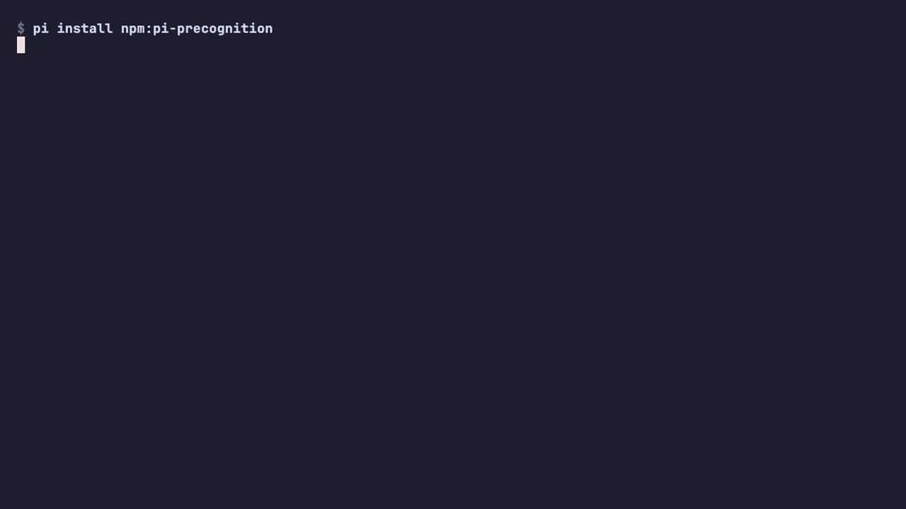

# pi-precognition

<p align="center">
  <strong>Predict the wait, not the answer.</strong>
</p>

<p align="center">
  <a href="https://www.npmjs.com/package/pi-precognition"></a>
  <a href="https://github.com/ultronisnice/pi-precognition/blob/main/LICENSE"></a>
  
  
</p>

<p align="center">
  
</p>

---

## What is this?

Pi agents wait. They wait on `read`, `grep`, `git`, `npm test`, `typecheck`. The first tool call of a turn is the most predictable — and the most expensive — wait in the loop.

`pi-precognition` is a Pi-native latency layer that **warms verified tool-result futures during draft and idle time**, then commits them through the normal Pi tool path only when the workspace still causally matches.

It does not predict answers. It does not change the model-facing tool surface. It does not inject hidden context. It just makes the first wait disappear.

## Headline numbers

On the 15-second slow-command workload (`bash("npm test")` with 17s draft budget, n=3 paired runs, silent-futures mode):

| Metric | Baseline | precognition | Speedup |
| --- | ---: | ---: | ---: |
| **Cumulative blocked tool wait** | 15,234.70 ms | 29.16 ms | **522.5×** |
| **First tool result** | 18.37 s | 3.16 s | **5.82×** |
| **Task completion** | 21.91 s | 6.59 s | **3.32×** |
| Hidden injections | n/a | 0 | — |
| Cache hits / misses | n/a | 3 / 0 | — |
| Answer prediction | none | none | — |

Across a broader 15-paired-run live A/B over 5 small workloads (`anthropic/claude-opus-4-7`, randomized arm order):

- Completion **win rate: 93.3%**
- Average completion: **14.47 s → 10.35 s**
- Tool calls per turn: **39 → 21**
- Required post-check pass rate: **100% on, 100% off**

Full bench artifacts: [`validation/precog_live_ab_2026-05-15T05-57-56-215Z.md`](validation/precog_live_ab_2026-05-15T05-57-56-215Z.md), [latency report](docs/safety-model.md).

## Install

```bash
pi install npm:pi-precognition
```

Local smoke:

```bash
npm pack
pi install -l ./pi-precognition-0.1.0.tgz
```

Recommended environment (silent-futures, the cleanest mode):

```bash
PI_PRECOG=1
PI_PRECOG_TOOL_CACHE=1
PI_PRECOG_INJECTION_MODE=silent-futures
PI_PRECOG_COMMAND_FUTURES=1
```

Hard off switch: `PI_PRECOG=0`.

## How it works

1. **Observe draft input** via Pi's terminal hooks (debounced, in-memory, 50 ms).
2. **Extract evidence**: path mentions, changed-file correlations, intent tags.
3. **Background-warm** safe repo-local file reads, filtered `git status --short`, filtered `git diff --name-only`, bounded literal `rg` probes, and allowlisted `npm test` futures — each with a causal fingerprint (file mtime + size, lock + source + test file hashes).
4. **At `before_agent_start`**, do nothing visible: the model sees the normal tool surface.
5. **When the model asks for a tool**, wrap the call. If the warmed future's causal fingerprint still matches, return the warmed result in microseconds. Otherwise miss and run the real tool.

The primitive is simple:

> Predict the wait, not the answer.

## Safety model

`pi-precognition` treats draft text as untrusted input. It refuses:

- absolute path escapes and traversal
- symlink escapes after `realpath` containment
- `.env`, `.npmrc`, `.netrc`, `*.pem`, `*.key`, `auth.json`, `models.json`, `credentials*`, `secrets/`, `.ssh/`, `.aws/`, `.kube/`, `.docker/config.json`, `.config/gh/hosts.yml`
- `.git/`, `node_modules/`
- binary-looking files
- oversized files (default 24 KB ceiling)
- mutation tools (writes, deletes, bash commands outside the allowlist)

Read futures invalidate on file mutation or deletion. Command futures invalidate on any change to their causal file fingerprint. Stale futures miss safely and Pi falls through to the normal tool path.

Detail: [`docs/safety-model.md`](docs/safety-model.md).

## Reproduce the numbers

```bash
git clone https://github.com/ultronisnice/pi-precognition.git
cd pi-precognition
npm install
npm test
npm run typecheck

# Replay the headline demo locally
bash docs/demo.sh
```

The full live A/B harness used to produce the headline numbers lives in the upstream Pi agent toolkit and is being extracted into this package as `pi-precognition bench` for the v0.2 release.

## Why this is not speculative decoding

Speculative tool execution predicts what the model will do and runs it ahead. That risks executing the wrong action.

`pi-precognition` predicts **the wait**, not **the action**. It warms first-evidence reads and allowlisted command futures that the model is statistically likely to ask for, then only serves them when the model asks for the exact tool with matching args AND the causal world still validates. The model retains full agency. The wait disappears.

## Status

`pi-precognition` is **experimental**. The numbers above are real and reproducible, but the surface is small (n=3 to n=15 paired live runs, single provider). The next milestones:

- n=30 paired runs per workload, p50/p95/p99 + bootstrap CI
- Cross-provider replication (OpenAI Codex, Kimi, others)
- Multi-future DAG composition (read → grep → test → typecheck chain)
- Public `pi-precognition bench` CLI bundled with the package

Issues and PRs welcome.

## License

MIT.
