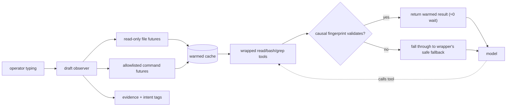

# pi-precognition

<p align="center">
  <strong>Predict the wait, not the answer.</strong>
</p>

<p align="center">
  <a href="https://www.npmjs.com/package/pi-precognition"></a>
  <a href="https://github.com/ultronisnice/pi-precognition/blob/main/LICENSE"></a>
  
  
</p>

<p align="center">
  
</p>

---

Validated tool futures for Pi coding agents. `pi-precognition` warms safe file, search, git, test, and typecheck results before the model waits for them — then serves only explicitly requested futures whose causal fingerprints still match.

It does not predict answers. In its default `silent-futures` mode it injects no hidden context. When tool-cache mode is on it transparently wraps Pi's `read`, `bash`, and `grep` tools — preserving their model-facing schemas and descriptions byte-for-byte — and adds a small `precognition_peek` diagnostic tool. The wait disappears; the model's tool contract does not change.

## The number

On the slow-command workload (a `bash("npm test")` that takes 15 seconds, with 17s of draft budget), `pi-precognition` drops the blocked tool wait from **15.2 seconds to 29 milliseconds** — a **522× collapse** of the dominant latency cost.

| Metric | Baseline | With `pi-precognition` | Speedup |
|---|---:|---:|---:|
| Blocked tool wait | 15,234 ms | 29 ms | **522×** |
| First tool result | 18.4 s | 3.2 s | **5.8×** |
| Task completion | 21.9 s | 6.6 s | **3.3×** |
| Hidden injections | n/a | 0 | — |
| Quality parity | n/a | 100% | — |

**n=3 paired live runs. Boundary: deterministic-class agent turns only.** See [`docs/benchmarks.md`](docs/benchmarks.md) for the full methodology, the workload class breakdown, and what these numbers do **not** mean.

## Research framing

Tool execution can dominate agent latency. PASTE ([arXiv:2603.18897](https://arxiv.org/abs/2603.18897)) showed that speculatively executing likely next tool calls while the model reasons can cut average task completion time by 48.5%.

`pi-precognition` operates one layer earlier:

> PASTE speculates **while the model is thinking.**
> `pi-precognition` speculates **while the operator is typing.**

The two approaches compose. The package runs an allowlisted set of read-only commands (`npm test`, `npm run typecheck`, `git status`, `ls`, etc.) during operator-draft time to *warm* their results. It does **not** speculatively execute mutating actions, and it does **not** auto-decide which tool the model will call next. The model still drives every served tool call; we just had the result ready, fingerprint-validated, when it asked.

## Install

```bash
pi install npm:pi-precognition
```

Recommended environment (safest defaults):

```bash
PI_PRECOG=1
PI_PRECOG_TOOL_CACHE=1
PI_PRECOG_COMMAND_FUTURES=1
PI_PRECOG_INJECTION_MODE=silent-futures
```

Hard off switch:
```bash
PI_PRECOG=0
```

## What it does

1. **Observes draft input** via Pi's terminal-input hooks (debounced, in-memory, ~50 ms analysis only).
2. **Extracts evidence**: path mentions, changed-file correlations, intent tags.
3. **Background-warms** safe repo-local file reads, filtered `git status`/`git diff`, bounded literal `rg` probes, and an allowlisted set of `bash` command futures (`npm test`, `npm run typecheck`, `npm run lint`, `vitest`, `jest`, `pytest`, `git status`, `git log`, `cat package.json`, `ls`) — each with a class-specific causal fingerprint.
4. **At `before_agent_start`** in `silent-futures` mode: nothing visible. The model sees the normal tool surface.
5. **When the model asks for a tool**: re-validate the causal fingerprint. If it still matches, serve the warmed result through the wrapped Pi-compatible tool (same model-facing schema as Pi's built-in). Otherwise miss safely and fall through to the wrapper's safe fallback implementation (repo-containment + secret denylist enforced).

The primitive is one sentence:

> Predict the wait, not the answer.

## Architecture



Five things compose:
1. **Draft observer** — debounced terminal-input hook (~50 ms in-memory analysis)
2. **Read-only futures** — repo-local file warms, secret-denylisted
3. **Command futures** — 13 allowlisted bash classes (`npm test`, `tsc --noEmit`, `git status`, ...), each with a class-specific causal fingerprint
4. **Wrapped tools** — `read`/`bash`/`grep` execute path with identical model-facing contract; cache lookup → causal validation → serve-or-fallthrough
5. **Hard off switch** — `PI_PRECOG=0` makes the entire extension a no-op

## What it does not do

- Does not predict what the model will say. The model still emits every tool call and every response.
- Does not execute mutating actions speculatively. Reads, status probes, and an allowlisted set of read-only commands only.
- Does not mutate workspace state. Ever.
- Does not serve a stale future. Every cache hit re-validates against current workspace state (file mtime/size for reads; per-class causal fingerprint for fingerprinted commands; TTL for fast probes like `git status`).
- Does not read `.env`, secrets, SSH config, AWS credentials, Docker auth, or any path matching the secret denylist (see [`docs/safety-model.md`](docs/safety-model.md)).
- Does not escape the working repo (realpath containment after symlink resolution).

## Safety

See [`docs/safety-model.md`](docs/safety-model.md). The invariants are:

- **I1.** Explicit request only — futures are served only when the model calls the matching tool.
- **I2.** No answer prediction — we cache tool *results*, not model output.
- **I3.** No mutation speculation — read-only futures and allowlisted read-only command futures only.
- **I4.** Causal-fingerprint validation at serve time — stale futures never serve.
- **I5.** Repo-local only — realpath containment after symlink resolution.
- **I6.** Secret-path denylist — `.env`, credentials, SSH/AWS/Docker config.
- **I7.** Skipped trees — `node_modules/`, `.git/`.
- **I8.** Bounded file size (24 KB default).
- **I9.** Binary refusal.
- **I10.** Hard off switch (`PI_PRECOG=0`).

The package is designed so that if you find a path that violates any invariant above, it is a release-blocking bug.

## Limits

- **Class-conditional.** Strong on deterministic agent turns (file reads, command runs, repo queries). Adds no measurable value on analytical or creative turns where the model is generating content from reasoning.
- **JS/TS + Python + npm + git surface today.** Other ecosystems (Cargo, Go, Maven, Bazel) work for file reads but the bash command class registry would need extension.
- **Single workspace per Pi process.** Cross-repo / multi-cwd scenarios not currently supported.
- **No live model-side compounding learning.** The current package is a deterministic primitive. Compounding pattern learning is a separate research direction.

## Reproducing the numbers

```bash
git clone https://github.com/ultronisnice/pi-precognition.git
cd pi-precognition
npm install
npm test                # 52 tests, all five injection modes, ~3s
npm run typecheck
npm run bench:local     # same as test — local microbenchmark + safety gates
npm run demo:visual     # ~18s scripted animation of the headline numbers (NOT a live run)
```

Live-API benchmark replay is being extracted into a `pi-precognition bench` CLI for the v0.3 release.

## Modes

| Mode | What the model sees | Recommended for |
|---|---|---|
| `silent-futures` (default) | Nothing hidden. Cache serves through normal tools. | **Production** |
| `verified-futures` | Tiny receipt that futures are armed. | Diagnostic |
| `cache-index` | Cache keys but not contents. | Economical context |
| `full` | Warmed file contents in a hidden custom message. | Bench/research |

Every headline number is measured against `silent-futures`. The broader 15-paired mixed A/B in [`docs/benchmarks.md`](docs/benchmarks.md) was run with `full` injection mode and is labeled there as historical/diagnostic context.

## Status

`pi-precognition` is research-backed and tests green under five injection-mode environments. The numbers above are reproducible. The next milestones:

- n=30+ paired live runs per workload with bootstrap CI
- Cross-provider replication (OpenAI Codex, Kimi)
- `pi-precognition bench` CLI bundled with the package

Issues and PRs welcome.

## Why this is not speculative tool execution

PASTE and Speculative Actions (2025) speculatively *execute* likely tool calls. If the prediction is wrong, the side effect already happened — and for mutating tools that's a real risk.

`pi-precognition` only ever **serves** cached results *after* the model explicitly requests the matching tool. Warming happens during operator typing; serving happens only on explicit request, gated by causal-fingerprint validation. A wrong warm guess is wasted I/O during draft time — never a wrong action. The model retains full agency. The wait disappears.

## License

MIT.
